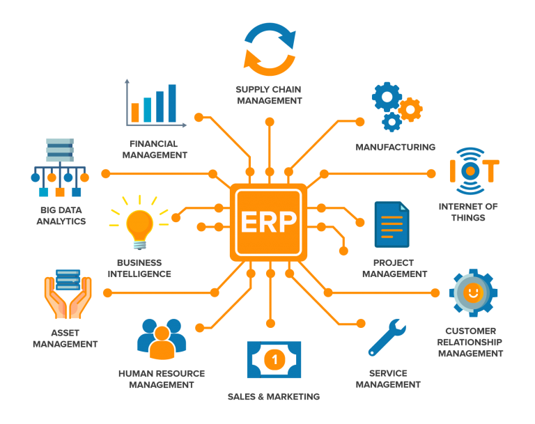
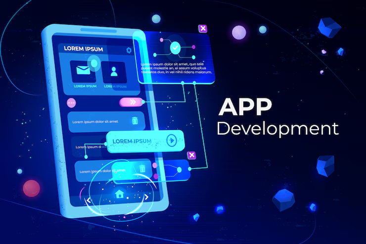
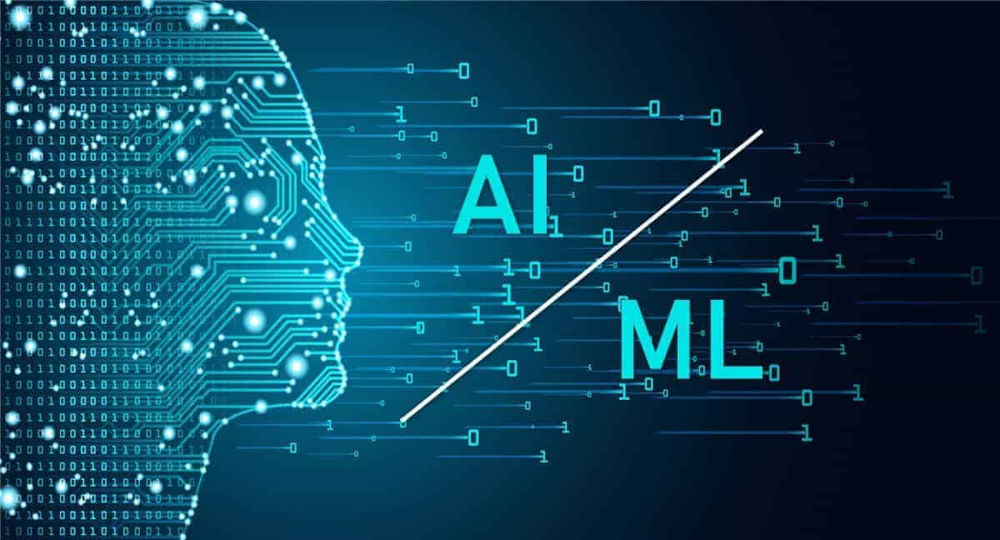

## IT Consultancy

ETHERVAL menawarkan **layanan konsultasi IT** yang disesuaikan untuk bisnis di berbagai industri. Tim profesional kami menyediakan **perencanaan strategis IT, manajemen infrastruktur, keamanan siber, komputasi awan**, dan **pengembangan perangkat lunak secara mandiri**. Dengan pendekatan yang **berpusat pada klien**, kami membantu bisnis meningkatkan efisiensi operasional, mengurangi biaya, dan tetap unggul dalam persaingan. Percayakan ETHERVAL untuk menjadi mitra andalan Anda dalam bidang IT yang terus berkembang.

##  ERP Implementation

ETHERVAL berkomitmen untuk memberikan solusi **implementasi ERP** yang dirancang khusus untuk meningkatkan kinerja bisnis Anda. Dengan tim profesional berpengalaman, kami menyediakan layanan menyeluruh mulai dari perencanaan hingga pengelolaan sistem ERP. Pendekatan kami yang *berpusat pada klien* memastikan solusi yang kami tawarkan selaras dengan tujuan dan kebutuhan bisnis Anda. Percayakan ETHERVAL untuk membantu Anda meningkatkan efisiensi operasional dan mengoptimalkan proses bisnis melalui implementasi ERP yang sukses.

## Mobile App Development

ETHERVAL menyediakan solusi **pengembangan aplikasi mobile** untuk meningkatkan efisiensi operasional bisnis Anda. Tim profesional kami yang berpengalaman mengelola semua aspek, mulai dari perencanaan hingga pengembangan aplikasi yang inovatif. Dengan pendekatan *berpusat pada klien*, aplikasi mobile kami memastikan akses cepat dan mudah ke data, kapan saja dan di mana saja. Percayakan **ETHERVAL** untuk mengoptimalkan proses bisnis Anda melalui solusi aplikasi mobile yang inovatif.

## Artificial Intelligence & Machine Learning

ETHERVAL mengkhususkan diri dalam implementasi **AI dan ML** untuk meningkatkan kinerja bisnis Anda. Tim ahli kami menyediakan solusi khusus, dari analisis data hingga model prediktif. Dengan teknologi terbaru, kami membantu bisnis mengotomatisasi proses dan membuat keputusan lebih cerdas. Percayakan **ETHERVAL** untuk solusi AI & ML yang inovatif dan efektif.

## Industrial Internet of Things \(IIoT)

ETHERVAL menyediakan solusi **Industrial IoT (IIoT)** untuk meningkatkan efisiensi dan produktivitas bisnis Anda. Tim ahli kami merancang dan mengimplementasikan sistem IIoT yang memungkinkan pemantauan dan pengelolaan perangkat industri secara real-time. Dengan teknologi IIoT terbaru, kami membantu bisnis mengoptimalkan operasional, mengurangi downtime, dan meningkatkan kualitas produksi. Percayakan **ETHERVAL** untuk mengintegrasikan solusi IIoT yang inovatif dan efektif ke dalam bisnis Anda.

## ☏ Contact Us

<b>Graha Bukopin Lt. 7</b>

Jln. Panglima Sudirman No.10-18, Embong Kaliasin Kec. Genteng, Surabaya, Jawa Timur 60271

<b>Telp.</b>

<a href="https://wa.link/bjr2pr">(+62) 811-307-8217</a>

<b>Email</b>

<a href="mailto:info@etherval.id">info@etherval.id</a>

<iframe width="100%" height="600" frameborder="0" scrolling="no" marginheight="0" marginwidth="0" src="https://maps.google.com/maps?width=100%25&amp;height=600&amp;hl=en&amp;q=graha%20bukopin+(ETHERVAL%20IT%20Consultancy)&amp;t=&amp;z=15&amp;ie=UTF8&amp;iwloc=B&amp;output=embed"><a href="https://www.gps.ie/">gps vehicle tracker</a></iframe>
